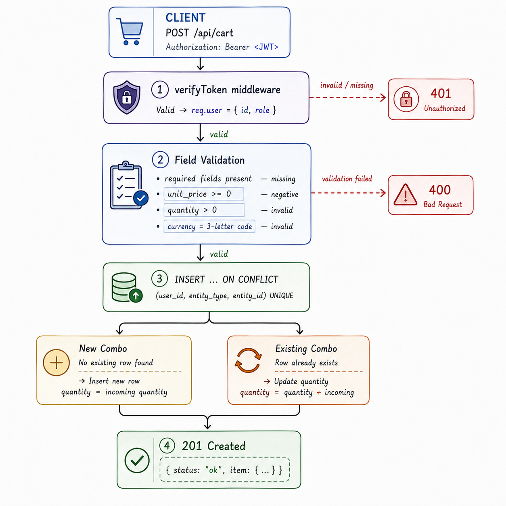
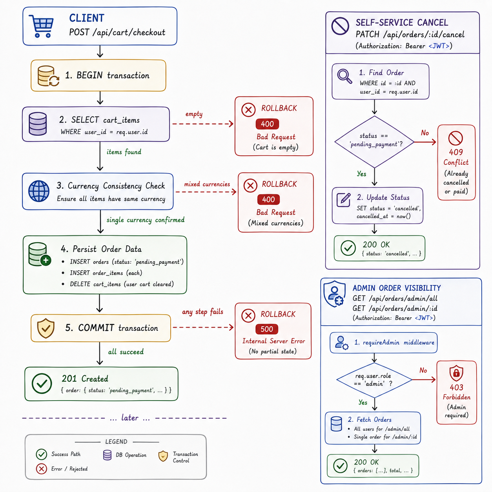

# MODULE 06: Universal Cart & Checkout

## 1. System Overview

The Universal Cart & Checkout engine operates as the ecosystem's agnostic staging area for transactional data. It has no concept of "products" specifically — a cart item can represent a physical good, a course seat, or an event ticket, using the same polymorphic `entity_type`/`entity_id` pattern first established in Module 03. Nothing about this module's logic changes based on what kind of thing is being purchased.

Every cart item **snapshots** its name, price, and currency at the moment it's added, rather than looking those values up live. This means the module works completely standalone — it never needs to call out to a catalog service to function — and a cart's total can never silently shift because a price changed elsewhere while something sat unpurchased.

This module's scope is deliberately narrow. It stages a transaction and hands off a `pending_payment` order — it does not verify stock (that's Module 08's job), process an actual payment (Module 07), or manage recurring billing (Module 12). The "universal" promise isn't that this one module does everything for every platform; it's that the full 20-module ecosystem covers every case, with each module staying narrowly scoped.

## 2. Core Capabilities

- **Polymorphic Line Items:** Any resource type can be added to a cart via `entity_type`/`entity_id`, with no schema dependency on the resource's origin.
- **Snapshot Pricing:** Name, price, and currency are locked in at add-time, immune to later changes elsewhere in the ecosystem.
- **Idempotent-Friendly Additions:** Adding the same item twice accumulates quantity on the existing row via `ON CONFLICT`, rather than creating a duplicate.
- **Multi-Currency Awareness:** Items can be added in any valid ISO 4217 currency code. Checkout explicitly rejects a cart containing more than one currency, rather than silently producing a meaningless combined total.
- **Zero-Price Items Supported:** Free trials, promotional items, and $0 tickets are valid, not treated as invalid input.
- **Transactional Checkout:** Order creation, order-item insertion, and cart clearing all happen inside a single database transaction — if any step fails, all of it rolls back, leaving no partial state.
- **Guarded Order Lifecycle:** Orders can be self-service cancelled only while still `pending_payment`; an already-cancelled or paid order cannot be cancelled again.
- **Admin Visibility:** Users with the `admin` role can view any order across any user, read-only, without bypassing the self-service cancellation boundary.

## 3. Technology Stack

- **Runtime Environment:** Node.js
- **Web Framework:** Express.js
- **Relational Database:** PostgreSQL (interfaced via the `pg` library)
- **Authentication Core:** jsonwebtoken (JWT), verifying tokens issued by Module 01's IAM-Engine
- **Environment Management:** dotenv

## 4. Development & Testing Environment

- **Terminal Operations:** Git Bash was used for process execution and database script execution.
- **API Testing & Verification:** Bruno (VS Code extension) was used to verify transactional integrity, currency validation, and role-based admin access.
- **Database Hosting:** PostgreSQL hosted on Railway, shared across modules via strictly isolated, non-foreign-keyed tables — except within this module's own `orders`/`order_items` relationship, which correctly uses a real foreign key, since both tables belong to the same service.

## 5. Architecture & Data Flow

<table width="100%">
  <tr>
    <td width="60%" valign="top">
      <h2>Part 1: Add-to-Cart Pipeline</h2>
      <p>
        A request must first pass <strong>Token Verification</strong>, then a <strong>Field Validation</strong> layer checking required fields, non-negative pricing, positive quantity, and a valid three-letter currency code.
      </p>
      <p>
        Persistence relies on the database's own <code>UNIQUE</code> constraint on <code>(user_id, entity_type, entity_id)</code>: a new combination inserts a fresh row, while a repeat combination increments the existing row's quantity via <code>ON CONFLICT</code>, making the endpoint naturally safe to call repeatedly.
      </p>
    </td>
    <td width="40%" valign="top" align="center">
      
      <br><br>
      <i><strong>Fig 1:</strong> Authentication, validation, and conflict-safe persistence.</i>
    </td>
  </tr>
</table>

<br>

<table width="100%">
  <tr>
    <td width="60%" valign="top">
      <h2>Part 2: Transactional Checkout & Order Lifecycle</h2>
      <p>
        Checkout wraps every write in a single database transaction. An empty cart or a cart spanning multiple currencies is rejected before any write occurs; otherwise, the order, its line items, and the cart's clearance all commit together, or none of them do.
      </p>
      <p>
        Beyond creation, an order's lifecycle is intentionally constrained: self-service cancellation only succeeds from <code>pending_payment</code>, while admin routes provide full read visibility across every user's orders without granting any additional write power.
      </p>
    </td>
    <td width="40%" valign="top" align="center">
      
      <br><br>
      <i><strong>Fig 2:</strong> Atomic checkout and guarded order-state transitions.</i>
    </td>
  </tr>
</table>

## 6. Database Schema & Architecture

**Table Structure: `cart_items`**

| Column Name | Data Type | Constraints | Description |
| :--- | :--- | :--- | :--- |
| `id` | SERIAL | PRIMARY KEY | Unique identifier for the cart row. |
| `user_id` | INTEGER | NOT NULL | Sourced from a verified JWT, never client input. |
| `entity_type` | VARCHAR(50) | NOT NULL | The kind of resource this line item represents. |
| `entity_id` | VARCHAR(100) | NOT NULL | The specific resource instance. |
| `item_name` | VARCHAR(255) | NOT NULL | Snapshotted at add-time. |
| `unit_price` | DECIMAL(10,2) | NOT NULL | Snapshotted at add-time; zero is valid. |
| `currency` | VARCHAR(3) | NOT NULL, DEFAULT 'INR' | ISO 4217 currency code, snapshotted at add-time. |
| `quantity` | INTEGER | NOT NULL, DEFAULT 1, CHECK > 0 | Enforced at the database level, not just the application. |
| `added_at` / `updated_at` | TIMESTAMP | DEFAULT NOW() | Standard timestamps. |

`UNIQUE (user_id, entity_type, entity_id)` — the constraint that makes repeat additions accumulate rather than duplicate.

**Table Structure: `orders`**

| Column Name | Data Type | Constraints | Description |
| :--- | :--- | :--- | :--- |
| `id` | SERIAL | PRIMARY KEY | Unique order identifier. |
| `user_id` | INTEGER | NOT NULL | The purchasing user. |
| `status` | VARCHAR(20) | DEFAULT 'pending_payment' | `pending_payment`, `paid` (set by Module 07 in future), or `cancelled`. |
| `total` | DECIMAL(10,2) | NOT NULL | Computed at checkout from the cart's contents. |
| `currency` | VARCHAR(3) | NOT NULL | Confirmed single across every item in the order. |
| `created_at` / `updated_at` | TIMESTAMP | DEFAULT NOW() | Standard timestamps. |

**Table Structure: `order_items`**

| Column Name | Data Type | Constraints | Description |
| :--- | :--- | :--- | :--- |
| `id` | SERIAL | PRIMARY KEY | Unique line-item identifier. |
| `order_id` | INTEGER | REFERENCES orders(id) ON DELETE CASCADE | A genuine foreign key — valid here since both tables belong to this same service. |
| `entity_type` / `entity_id` | VARCHAR | NOT NULL | Carried over from the cart item at checkout time. |
| `item_name` / `unit_price` / `currency` / `quantity` | — | NOT NULL | Final snapshotted values, permanently frozen at the moment of purchase. |

## 7. Setup & Installation Sequence

**Step 1: Environment Variable Configuration**
```text
PORT=5005
DATABASE_URL=postgresql://[user]:[password]@[host]:[port]/[database]
JWT_SECRET=[must exactly match Module 01's JWT_SECRET]
```

**Step 2: Dependency Installation**
```bash
npm install
```

**Step 3: Database Schema**

Execute the `cart_items`, `orders`, and `order_items` table definitions (Section 6) before first boot.

**Step 4: Engine Initialization**
```bash
node src/server.js
```
*Expected Output:* Console confirms the server is listening on port `5005`.

## 8. API Interface Contract

### 8.1 Public Routes
- **`GET /health`** — Confirms the service is running and can reach the database.

### 8.2 Protected Routes (require `Authorization: Bearer <token>`)

- **`POST /api/cart`** — Adds an item to the cart, or increments quantity if it already exists.
- **`GET /api/cart`** — Retrieves the current cart, with a computed total and a list of currencies present.
- **`PATCH /api/cart/:id`** — Updates an item's quantity. Ownership-scoped.
- **`DELETE /api/cart/:id`** — Removes an item. Ownership-scoped.
- **`POST /api/cart/checkout`** — Converts the current cart into an order. Fails on an empty or multi-currency cart.
- **`GET /api/orders`** — Lists the authenticated user's orders.
- **`GET /api/orders/:id`** — Retrieves a specific order's full detail. Ownership-scoped.
- **`PATCH /api/orders/:id/cancel`** — Cancels an order still in `pending_payment`.

### 8.3 Admin-Only Routes (require `admin` role)

- **`GET /api/orders/admin/all`** — Lists every order across every user.
- **`GET /api/orders/admin/:id`** — Retrieves any order's full detail, regardless of owner.

## 9. Known Limitations & Roadmap

- **No stock verification at checkout.** Module 08 (Catalog & Inventory) doesn't exist yet, so nothing here confirms an item is actually available.
- **Orders remain `pending_payment` indefinitely.** Advancing status to `paid` is Module 07's responsibility, not built yet.
- **Admin access is read-only by design.** Admins can view any order, but cannot cancel or modify one on a user's behalf — a deliberate scope boundary, not an oversight.
- **No currency conversion.** A multi-currency cart must be split into separate checkouts by the client; this module does not convert between currencies.
- **Recurring or subscription billing is explicitly out of scope.** That responsibility belongs to Module 12 by design.
- **Gateway integration pending.** Module 02's reverse proxy does not yet route to this service.

## 10. Testing Guide: Running the Full Ecosystem

This module depends on Module 01 for token issuance.

**Step 1:** Boot Module 01 (`port 5001`) and this module (`port 5005`).

**Step 2:** Obtain a token via `POST http://localhost:5001/api/auth/login`.

**Step 3:** Add items via `POST /api/cart`, inspect via `GET /api/cart`, then checkout via `POST /api/cart/checkout`.

**Step 4:** Confirm the resulting order via `GET /api/orders/:id`, and test cancellation via `PATCH /api/orders/:id/cancel`.

**Step 5 (admin):** Promote a test user's `role` to `admin` directly via SQL if the `/make-admin` route is unavailable, log in again for a fresh token, and confirm `GET /api/orders/admin/all` returns orders across every user.
